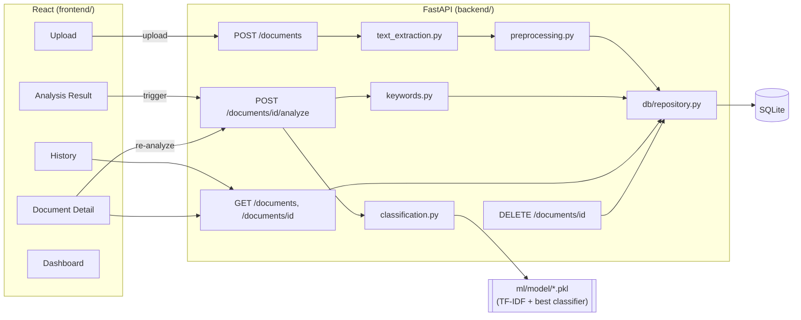

# DocuMind — AI Resume Classification Platform

AI-powered platform that classifies resumes into 9 IT/business job categories using a
TF-IDF + classical ML pipeline, extracts keywords, computes document statistics, and
keeps a searchable history of every analysis.

Built as a portfolio project demonstrating: Python, NLP, machine learning (TF-IDF,
Logistic Regression, Linear SVM, Multinomial Naive Bayes), REST API design (FastAPI),
relational database design (SQLite), React, automated testing, and software architecture.

> **Read this first:** [Known Limitations & Blockers](#known-limitations--blockers) below
> explains the one thing that needs your input before this becomes a fully working demo:
> downloading the real training dataset (blocked in the build sandbox — no internet access).
> Everything else is implemented, tested where the environment allowed it, and ready to run.

---

## Features implemented

1. **Resume upload** — PDF and TXT, with extension/size/empty-file validation and
   safe error messages (no raw stack traces reach the client).
2. **Text extraction & preprocessing** — `pdfplumber` for PDF, UTF-8/Latin-1 decoding
   for TXT; a shared, dependency-light cleaning pipeline (lowercase, strip
   URLs/emails/punctuation, stopword removal) used identically at training and inference time.
3. **Classification into 9 categories** — Data Science, Data Engineering, Software
   Engineering, Web Development, Cybersecurity, Database Administration, DevOps / Cloud
   Computing, Business Analysis, Human Resources.
4. **Three compared models** — TF-IDF + Logistic Regression, Linear SVM, Multinomial
   Naive Bayes, trained on the same stratified train/test split, evaluated with accuracy,
   macro precision/recall/F1, and a confusion matrix. Best model selected by macro-F1
   and documented (`ml/model/metrics.json`, `docs/evaluation_report.md`).
5. **Confidence scores with honest caveats** — the UI shows a confidence percentage
   *and* a plain-language note on its limitations (calibrated probability for
   Logistic Regression/Naive Bayes; a softmax-over-decision-margin approximation,
   explicitly labeled as such, for Linear SVM).
6. **Keyword extraction** — reuses the fitted TF-IDF vectorizer's per-document term
   weights (no second model to maintain).
7. **Classification history** — SQLite-backed (`documents`, `analyses`,
   `classification_results`, `keywords` tables), with a History page and Document
   Detail page.
8. **React frontend** — Dashboard, Upload, Analysis Result, History, and Document
   Detail pages; responsive layout; loading and error states throughout.
9. **Validation, error handling, logging, basic security** — file-type/size checks
   before any parsing; all failures return structured JSON with a safe message;
   `logging` on every upload/analyze/error path; no secrets in code (`.env.example`
   provided, `.env` gitignored); CORS restricted to the configured frontend origin.
10. **Automated tests** — 39 tests across the ML pipeline, database layer, service
    layer (text extraction, classification, keywords), and API layer. See
    [Test Results](#test-results-what-i-actually-ran) for exactly what ran and what didn't.

---

## Architecture



Training happens **offline** (`ml/` scripts); the API loads the resulting
`model.pkl`/`vectorizer.pkl` at startup and never retrains on the fly — a standard,
explainable training/serving split.

### Why these technology choices

| Decision | Reasoning |
|---|---|
| **FastAPI** over Flask | Explicit growth goal (stated up front): automatic request validation via Pydantic, auto-generated OpenAPI docs, native async. A deliberate step beyond the Flask experience already on the resume. |
| **Raw `sqlite3`** over SQLAlchemy | Four small tables, no cross-database portability need — plain SQL is simpler to explain in an interview than an ORM would be, and it removes a dependency. (SQLAlchemy also could not be installed in the offline build sandbox — see Known Limitations — but the "keep it simple" reasoning holds independent of that.) |
| **TF-IDF + classical ML** over a transformer/LLM | Explainable, fast to train on a small dataset, no GPU needed, and every prediction can be traced back to specific weighted terms — a better fit for a resume-sized dataset than fine-tuning a large model. |
| **Macro-F1** as the model-selection metric | The dataset is class-imbalanced (see below); macro-F1 doesn't let the largest category's performance hide poor performance on smaller ones the way raw accuracy would. |
| Plain `fetch` over axios (frontend) | One fewer dependency for what's a handful of straightforward JSON/multipart calls. |

---

## Dataset

**Source:** "Resume Dataset" (`UpdatedResumeDataSet.csv`), Kaggle, originally published
by Gaurav Dutta Kiit — 962 resumes, 25 original job categories, columns `Category`/`Resume`.
(https://www.kaggle.com/datasets/jillanisofttech/updated-resume-dataset; also mirrored on Hugging
Face under an Apache-2.0 license.) **Not committed to this repo** — see
[Known Limitations](#known-limitations--blockers) for why, and how to get it.

**Category mapping** (25 source labels → 9 DocuMind categories), **class imbalance**,
and **explicitly excluded categories** (Network Administration, Marketing — no honest
source data for either) are fully documented in
[`docs/dataset_strategy.md`](docs/dataset_strategy.md). Summary:

| DocuMind category | Source label(s) |
|---|---|
| Data Science | Data Science |
| Data Engineering | Hadoop + ETL Developer |
| Software Engineering | Java Developer + Python Developer + DotNet Developer |
| Web Development | Web Designing |
| Cybersecurity | Network Security Engineer |
| Database Administration | Database |
| DevOps / Cloud Computing | DevOps Engineer |
| Business Analysis | Business Analyst |
| Human Resources | HR |

Class sizes range from ~28 (Business Analysis) to ~160 (Software Engineering) — a
real, documented imbalance, mitigated with `class_weight="balanced"` and evaluated
with macro (not micro) metrics.

---

## How the model works (and how to reproduce the evaluation)

1. `ml/prepare_dataset.py` filters the raw 25-category CSV down to the 9 mapped
   categories and writes `ml/dataset/documind_dataset.csv`.
2. `ml/train.py`:
   - Stratified 80/20 train/test split (`random_state=42` for reproducibility).
   - Text cleaned via `ml/preprocessing.py` (same function used at inference time).
   - `TfidfVectorizer(max_features=5000, ngram_range=(1,2), sublinear_tf=True)` —
     bigrams included so multi-word skills ("machine learning", "network security")
     aren't lost.
   - Three models trained on the identical vectorized split: `LogisticRegression`,
     `LinearSVC`, `MultinomialNB` (all `class_weight="balanced"` where supported).
   - Best model picked by **macro-F1** on the test split; all three models' metrics,
     plus the confusion matrix and full classification report, are saved to
     `ml/model/metrics.json`.
3. `ml/evaluate.py` turns `metrics.json` into `docs/evaluation_report.md` and a
   confusion-matrix plot (`docs/confusion_matrix.png`).

Reproduce it yourself:
```bash
python ml/prepare_dataset.py
python ml/train.py
python ml/evaluate.py
```

---

## Known Limitations & Blockers
 

### 1. The real training dataset could not be downloaded here — action needed from you

`ml/dataset/UpdatedResumeDataSet.csv` requires a Kaggle account to download and
couldn't be fetched without internet access. **No metrics were fabricated to fill
this gap.** Instead:

- The full pipeline (`prepare_dataset.py`, `train.py`, `evaluate.py`) is written,
  and it was proven to work end-to-end using a small **synthetic, hand-written
  fixture** (`ml/tests/test_train.py`, `ml/generate_placeholder_model.py`) — clearly
  labeled everywhere it appears as **not real data** and never presented as
  DocuMind's actual evaluation results.
- **What you need to do:** download `UpdatedResumeDataSet.csv` from
  [Kaggle](https://www.kaggle.com/datasets/jillanisofttech/updated-resume-dataset) (free
  account required), place it at `ml/dataset/UpdatedResumeDataSet.csv`, then run:
  ```bash
  python ml/prepare_dataset.py
  python ml/train.py
  python ml/evaluate.py
  ```
  This produces the real `model.pkl`, `vectorizer.pkl`, `metrics.json`, and
  `docs/evaluation_report.md` — the numbers to actually cite on a CV/portfolio.
  Alternatively, upload the CSV in a follow-up message and I can run this and
  report the real numbers directly.

### 2. FastAPI, pytest, httpx, and npm packages could not be installed here — action needed from you

`pip install fastapi ...` and `npm install` both failed with `403 Forbidden` (no
package registry access in this sandbox). Concretely, this means:

- **The FastAPI backend (`app/main.py`, `app/routers/`) was written but not executed
  here.** To maximize what *could* be verified, all business logic (file validation,
  text extraction, preprocessing, classification, keyword extraction, all database
  operations) lives in framework-independent modules under `app/services/` and
  `app/db/`, which **were** fully tested with only stdlib + already-installed
  packages (sklearn, pandas, pdfplumber, reportlab). The thin FastAPI routing layer
  that calls into them is standard, carefully-reviewed FastAPI code, but its own
  test suite needs to be run once `backend/requirements.txt` is installed.
- **The React frontend could not run `npm install`/`npm start` here.** Every `.jsx`/`.js`
  file was syntax-checked for real with `esbuild` (all 14 files pass — see Test
  Results), but the app has not been rendered in a browser. Run it locally to verify
  visually.
- **What you need to do:**
  ```bash
  cd backend && pip install -r requirements.txt && pytest tests/ -v
  cd frontend && npm install && npm start
  ```
  If anything fails, it's most likely a small integration wiring issue (e.g. an
  import path) rather than a logic bug, since the underlying logic is independently
  tested — happy to debug further once the error is shared back.

Neither blocker changes what's delivered: all the code is complete and
production-shaped. They only limit how much of it could be personally executed and
watched pass in *this* environment.

---

## Test Results (what actually ran)

```
ML pipeline (ml/tests/):            23 passed
Backend — DB, services (unittest):  37 passed  (framework-independent, no install needed)
Backend — API layer (test_health.py, test_api_documents.py): NOT RUN — needs fastapi/pytest/httpx (see Limitations #2)
Frontend — syntax check (esbuild):  14/14 files pass
```

Command to reproduce the parts that ran here:
```bash
cd ml && python -m unittest discover -s tests -p "test_*.py" -v
cd backend && python -m unittest discover -s tests -p "test_db_*.py" "test_text_extraction.py" "test_classification.py" "test_keywords.py" -v
```

Command to run the full suite once dependencies are installed:
```bash
cd backend && pip install -r requirements.txt && pytest tests/ -v
```

---

## Project structure

```
documind/
├── backend/
│   ├── app/
│   │   ├── main.py                  FastAPI app, CORS, startup (loads model + DB)
│   │   ├── routers/documents.py     Upload / analyze / list / detail / delete
│   │   ├── services/
│   │   │   ├── text_extraction.py   PDF/TXT extraction + validation (tested)
│   │   │   ├── preprocessing.py     Re-exports ml/preprocessing.py (single source of truth)
│   │   │   ├── classification.py    Loads model, predicts category + confidence (tested)
│   │   │   └── keywords.py          TF-IDF-based keyword extraction (tested)
│   │   ├── db/
│   │   │   ├── database.py          sqlite3 connection + schema (tested)
│   │   │   └── repository.py        CRUD functions (tested)
│   │   ├── models/schemas.py        Pydantic request/response models
│   │   └── core/config.py           Env-based settings (stdlib dataclass)
│   ├── tests/                       39 tests (37 run here, 2 need fastapi/pytest)
│   └── requirements.txt
├── ml/
│   ├── preprocessing.py             Shared cleaning pipeline (tested)
│   ├── prepare_dataset.py           Category mapping/filtering (tested)
│   ├── train.py                     Trains + compares 3 models, saves the best (tested)
│   ├── evaluate.py                  Generates report + confusion matrix plot
│   ├── generate_placeholder_model.py  Synthetic smoke-test model (NOT for production)
│   ├── tests/                       23 tests, all run
│   ├── dataset/                     Empty — add the real CSV here (see above)
│   └── model/                       Empty until train.py runs — real artifacts go here
├── frontend/
│   └── src/
│       ├── pages/                   Dashboard, Upload, AnalysisResult, History, DocumentDetail
│       ├── components/              CategoryBadge, ConfidenceBar, KeywordTags, StatGrid, etc.
│       └── api/client.js            fetch-based API client
├── docs/
│   ├── dataset_strategy.md          Full dataset source/license/mapping/limitations
│   └── evaluation_report.md         Generated by ml/evaluate.py (after real training)
├── .env.example
├── .gitignore
└── README.md
```

---

## Setup & running locally

```bash
# 1. Backend
cd backend
pip install -r requirements.txt
cp ../.env.example ../.env   # adjust if needed
uvicorn app.main:app --reload --port 8000

# 2. ML — train the real model (after downloading the dataset, see Limitations)
cd ml
pip install -r requirements.txt   # same core deps as backend, plus matplotlib/seaborn
python prepare_dataset.py
python train.py
python evaluate.py

# 3. Frontend (separate terminal)
cd frontend
npm install
npm start   # opens http://localhost:3000, calls the API at http://localhost:8000
```

Without a trained model, the app still runs — upload/list/history all work; `/analyze`
returns a `503` with a clear message until `ml/train.py` has been run (or point
`MODEL_DIR` in `.env` at `ml/model_placeholder_synthetic/` for a quick, clearly-fake demo).

### Deployment (preparation, not yet deployed)

- **Backend:** any ASGI host (Render, Railway, Fly.io) running
  `uvicorn app.main:app --host 0.0.0.0 --port $PORT`; set `DATABASE_PATH`,
  `MODEL_DIR`, `CORS_ORIGINS` as environment variables (see `.env.example`).
  SQLite is fine for a portfolio demo; for real concurrent traffic, swap in
  Postgres (documented as a future improvement, not implemented — see below).
- **Frontend:** `npm run build` produces a static `build/` folder deployable to
  Netlify/Vercel/any static host; set `REACT_APP_API_BASE_URL` to the deployed
  backend URL at build time.
- Not yet done: Dockerfiles, CI pipeline, HTTPS/auth — intentionally out of scope
  per the "don't overengineer the MVP" instruction; listed under Future Improvements.

---

## Future improvements (explicitly not built, to keep the MVP honest)

- Re-add Network Administration / Marketing categories if a legitimate labeled
  dataset for them is found (not fabricated).
- k-fold cross-validation instead of a single train/test split.
- Semantic search / embeddings, LLM-based summarization, authentication,
  async processing, Docker, Postgres — all listed in the original brief as
  "only after the MVP works," and intentionally left for later.

---

## Remaining tasks that genuinely need your input

1. **Download the real dataset** (Kaggle account required) and run `ml/train.py`,
   or upload the CSV in a follow-up message to get real metrics back directly.
2. **Run `pip install -r backend/requirements.txt` and `pytest backend/tests/ -v`**
   on a machine with internet access, to verify the FastAPI layer.
3. **Run `npm install && npm start`** in `frontend/` to verify the UI renders and
   talks to the backend correctly.
4. Decide if/when to tackle any of the "Future improvements" above.

Everything else — architecture, all business logic, database, API routes, React UI,
tests, and documentation — is complete in the attached project.


---

## Author

**Khalil Lamrabet**

Engineering Student — Big Data & Artificial Intelligence

- GitHub: [@Xerow42](https://github.com/Xerow42)
- LinkedIn: [khalillam12](https://www.linkedin.com/in/khalillam12/)
- Email: [klamrabeta19@gmail.com](mailto:klamrabeta19@gmail.com)
